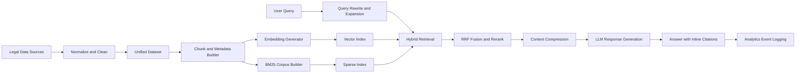
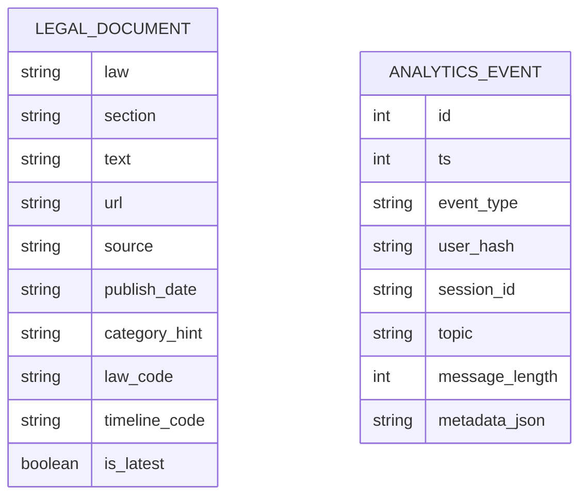
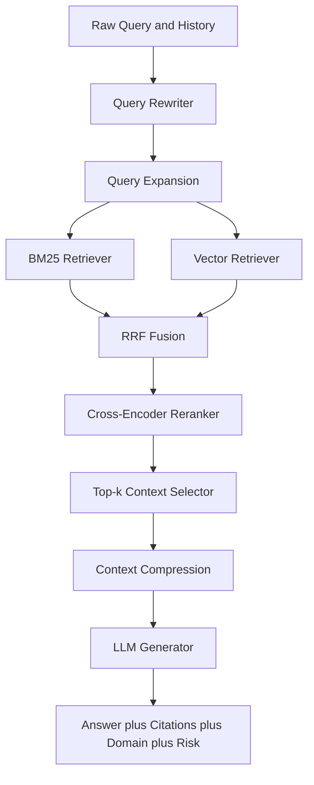
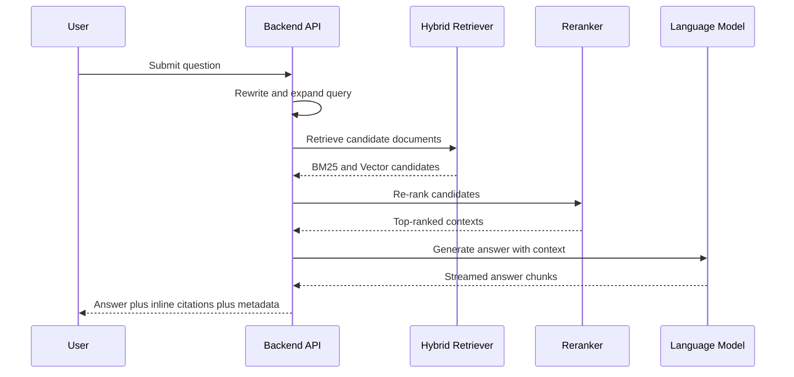
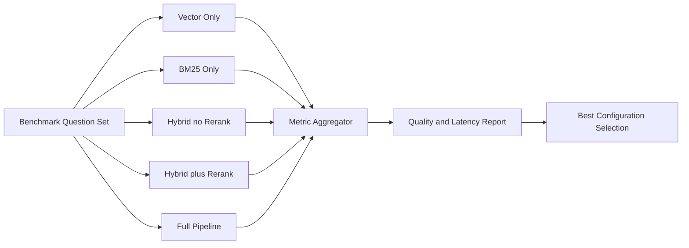
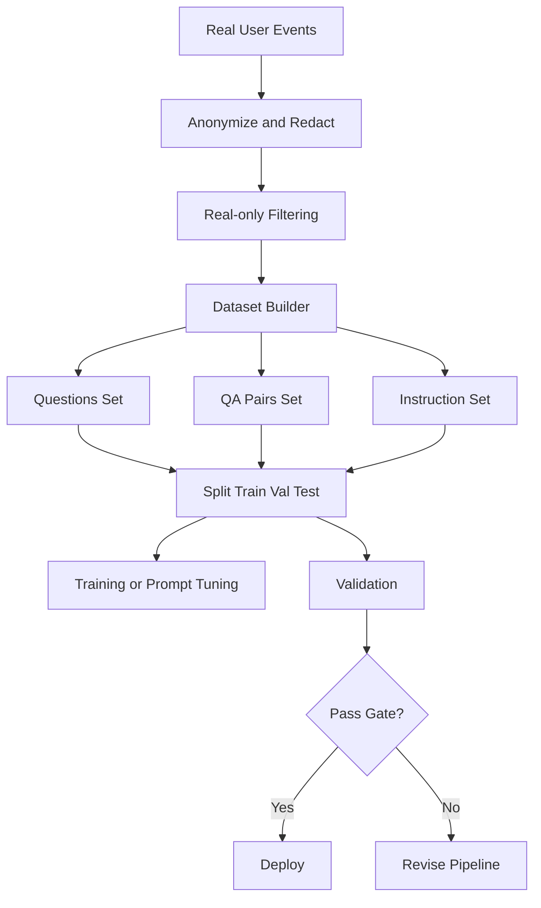
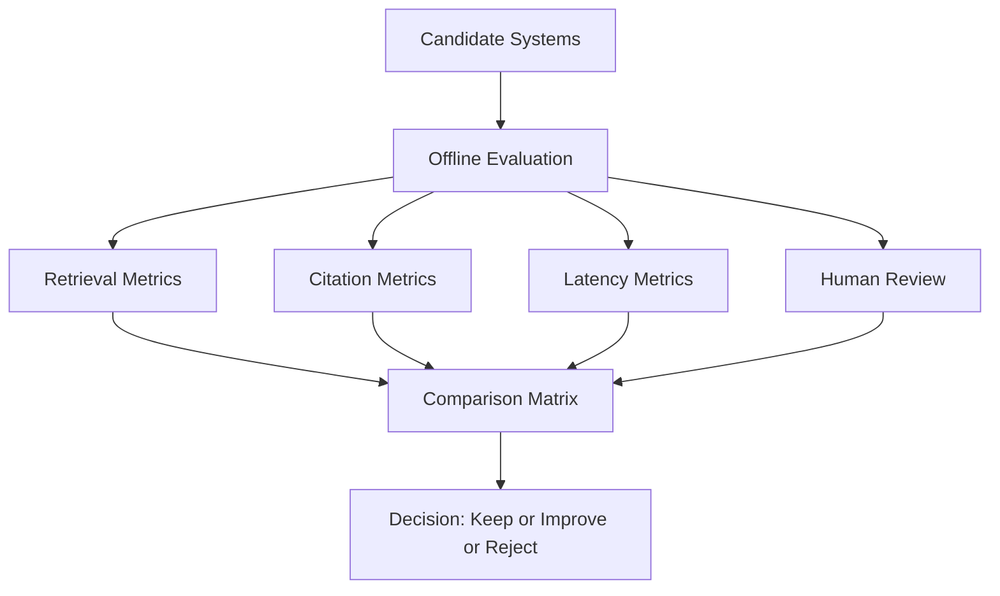

# Chapter 4 Technical Diagrams (Mermaid)

## Figure 4.1 Data Pipeline

## Figure 4.2 Dataset Schema

## Figure 4.3 Feature Flow

## Figure 4.4 Model Workflow

## Figure 4.5 Experiment Design

## Figure 4.6 Training and Validation Flow

## Figure 4.7 Result Comparison Design

